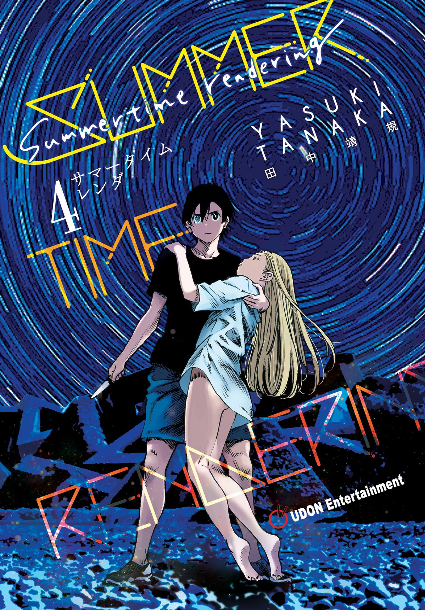
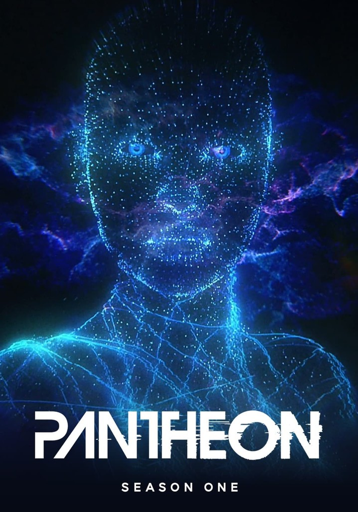

# Recomendacion-DesafioIA1
##Recomendacion de series bien chiclebomba

**Mi recomendación personal: Series
● ¿Qué voy a recomendar? 3 series de diferentes géneros
● ¿A quién va dirigida la página? Compañer@s de la cohorte 71
● ¿Qué información tendrá cada recomendación? Título, genero, duración (corta, mediana, larga), breve descripción, plataforma donde encontrar.
● ¿Qué quiero que suceda cuando el usuario interactúe con mi página? Que sea redirigida a donde a la plataforma para que se ponga a verla.

 
● HTML
● CSS
● Bootstrap
● JavaScript
● Git
● GitHub
● Cloude

4. Proceso con IA 

Me apoye de la IA para ciertas dudas respecto a la documentación y aplicación de bootstrap y aun que en su mayoría me ayudo también tuvo errores que logre identificar y que me ayudaron a saber cómo funcionan mejor algunas modificaciones dentro de las clases de las cards o el grid que en mi implementación no fui capaz de ver y con la ayuda de la ia logre identificarlas , también está en un cambio que era más tedioso como agregar botones a la navbar y mandarlos con su id correspondiente la IA en l ventana ejecuto los cambios bien pero produjo cambios que no se le pidieron y algunos si pidió permiso y se le negó, mientras que otros pequeños tomo la decisión de aplicarlo , afortunadamente como la ayuda que se le pidió era muy específica sabía perfectamente que deshacer dichos cambios incensarios.

5. Código generado vs. código propio 
código propio
<!DOCTYPE html>
<html lang="en">
<head>
    <meta charset="UTF-8">
    <meta name="viewport" content="width=device-width, initial-scale=1.0">
    <title>Recomendacion de series</title>
        <link href="https://cdn.jsdelivr.net/npm/bootstrap@5.3.8/dist/css/bootstrap.min.css" rel="stylesheet" integrity="sha384-sRIl4kxILFvY47J16cr9ZwB07vP4J8+LH7qKQnuqkuIAvNWLzeN8tE5YBujZqJLB" crossorigin="anonymous"><!-- para llamar a bootstrap sin installar-->
    <link rel="stylesheet" href="/css/styles.css">

</head>
<body>
<!-- Navbar -->

    <nav id="inicio" class="navbar bg-body-tertiary fixed-top">
        

            <a class="navbar-brand" href="#">
                
                SCB (Series Chicle Bomba)
            </a>
        

    </nav>

    <h1>Series Chicle Bomba</h1>

<!-- Recomendacion 1 -->
<!-- Organizacion de la tarjeta -->

    

        
<h2>Summer time rendering</h2>

        
<h3>Serie de anime sobre viajes en el tiempo</h3>
             
no podras parar hasta acabarla

        

        

            

                
                

                    <a href="https://www.disneyplus.com/es-mx/browse/entity-ad803e91-b02a-42c9-a6f8-29f6468a74fd" type="button" class="btn btn-outline-danger">Conoce donde puedes verla</a>
                    
<small class="text-body-secondary">Recomendada al %</small>

                    

                        

                    

                

            

        

    

    
    
    
    

    
    
    <!--*Footer-->
    <footer class="bg-dark text-white text-center py-4">
        

            © 2026 Derechos de las series a quien correspondan
        

    </footer>

<!-- para llamar a bootstrap sin installar-->

</body>
</html>

código con implementaciones de ayuda con ia

<!DOCTYPE html>
<html lang="en">
<head>
    <meta charset="UTF-8">
    <meta name="viewport" content="width=device-width, initial-scale=1.0">
    <title>Recomendacion de series</title>
        <link href="https://cdn.jsdelivr.net/npm/bootstrap@5.3.8/dist/css/bootstrap.min.css" rel="stylesheet" integrity="sha384-sRIl4kxILFvY47J16cr9ZwB07vP4J8+LH7qKQnuqkuIAvNWLzeN8tE5YBujZqJLB" crossorigin="anonymous"><!-- para llamar a bootstrap sin installar-->
    <link rel="stylesheet" href="/css/styles.css">

</head>
<body>
<!-- Navbar -->

    <nav id="inicio" class="navbar bg-body-tertiary fixed-top">
        

            <a class="navbar-brand" href="#">
                
                SCB (Series Chicle Bomba)
            </a>
            

                <a class="btn btn-outline-success" href="#corta">Corta</a>
                <a class="btn btn-outline-warning" href="#mediana">Mediana</a>
                <a class="btn btn-outline-danger" href="#larga">Larga</a>
            

        

    </nav>

    <h1>Series Chicle Bomba</h1>

    <h2>Estas son mis recomendaciones de animacion con una historia increible</h2>

<!-- Recomendacion 1 -->
<!-- Organizacion de la colocacion de latarjeta -->

    

        
<h2>Nombre de la serie: Summer time rendering</h2>
 
        
<h3>Descripcion</h3><!--todo Implementacion guiada por IA para formatear la columna -->
             
Una historia veraniega de ciencia ficción llena de suspenso y ambientada en una pequeña isla, comienza con Shinpei Ajiro, cuyo amigo de la infancia Ushio Kofune murió. Él regresa a su ciudad natal por primera vez en dos años para el funeral. Sou Hishigata, su mejor amigo, sospecha que algo anda mal con la muerte de Ushio y que alguien más puede morir a continuación. Se escucha un presagio siniestro cuando toda la familia de al lado desaparece repentinamente al día siguiente. Además, Mio recuerda haber visto una "sombra" tres días antes de la muerte de Ushio.

            
<!--todo Implementacion guiada por IA para formatear elemento al fondo a la izquierda -->
                <h4 class="mediana">Duracion: Mediana</h4>
                <a href="https://www.imdb.com/es/title/tt15686254/?ref_=nv_sr_srsg_0_tt_8_nm_0_in_0_q_summer%20time" class="imdb">Calificacion en IMDB: 8.2/10</a>
            

        

        

            
<!--Card de la recomendacion sacada de la documentacion de bootstrap--><!--todo Implementacion guiada por IA para formatear la card -->
                
                

                    <a href="https://www.disneyplus.com/es-mx/browse/entity-ad803e91-b02a-42c9-a6f8-29f6468a74fd" type="button" class="btn btn-outline-danger">Conoce donde puedes verla</a>
                    
<small class="text-body-secondary">Recomendacion del 95%</small>

                    

                        

                    

                

            

        

    

<!-- Recomendacion 2 -->
<!-- Organizacion de la colocacion de latarjeta -->

    

        
<h2>Nombre de la serie: Vivy Fluorite Eyes Song</h2>
 
        
<h3>Descripcion</h3><!--todo Implementacion guiada por IA para formatear la columna -->
             
Vivy es una IA que trata de hacer a todos felices con su canto mientras recibe una visita sorpresa. Este visitante inesperado la involucrará en eventos de gran repercusión en el futuro del mundo. Los problemas están por comenzar y necesitan la ayuda de Vivy.

            
<!--todo Implementacion guiada por IA para formatear elemento al fondo a la izquierda -->
                <h4 class="corta">Duracion: Corta</h4>
                <a href="https://www.imdb.com/es/title/tt13851958/?ref_=nv_sr_srsg_1_tt_2_nm_6_in_0_q_vivy%20" class="imdb">Calificacion en IMDB: 7.9/10</a>
            

        

        

            
<!--Card de la recomendacion sacada de la documentacion de bootstrap--><!--todo Implementacion guiada por IA para formatear la card -->
                
                

                    <a href="https://www.crunchyroll.com/es/series/GMEHME4M4/vivy--fluorite-eyes-song-?srsltid=AfmBOopZ_7jWVa0Xan2JUAmcyqAhgqUppbWvW7BIwO2thOlp82IMSYeA" type="button" class="btn btn-outline-danger">Conoce donde puedes verla</a>
                    
<small class="text-body-secondary">Recomendacion del 85%</small>

                    

                        

                    

                

            

        

    

<!-- Recomendacion 3 -->
<!-- Organizacion de la colocacion de latarjeta -->

    

        
<h2>Nombre de la serie: Pantheon</h2>
 
        
<h3>Descripcion</h3><!--todo Implementacion guiada por IA para formatear la columna -->
             
Dos adolescentes atribulados descubren sus conexiones personales con una nueva tecnología que funciona a expensas de los humanos,Maddie es una adolescente que sufre acoso, recibe ayuda online de un desconocido, que resulta ser David, su padre, ya fallecido. Su mente ha subido a la nube tras un escáner cerebral experimental. Y él no es el único….

            
<!--todo Implementacion guiada por IA para formatear elemento al fondo a la izquierda -->
                <h4 class="larga">Duracion: Larga</h4>
                <a href="https://www.imdb.com/es/title/tt11680642/?ref_=nv_sr_srsg_0_tt_8_nm_0_in_0_q_pantheon" class="imdb">Calificacion en IMDB: 8.5/10</a>
            

        

        
<!--todo Implementacion guiada por IA para formatear la columna -->
            
<!--Card de la recomendacion sacada de la documentacion de bootstrap--><!--todo Implementacion guiada por IA para formatear la card -->
                
                

                    <a href="https://www.netflix.com/mx/title/81937398" type="button" class="btn btn-outline-danger">Conoce donde puedes verla</a>
                    
<small class="text-body-secondary">Recomendacion del 100%</small>

                    

                        

                    

                

            

        

    

    <!--*Footer-->
    <footer class="bg-dark text-white text-center py-4">
        

            © 2026 Derechos de las series a quien correspondan
        

    </footer>

<!-- para llamar a bootstrap sin installar-->

</body>
</html>
